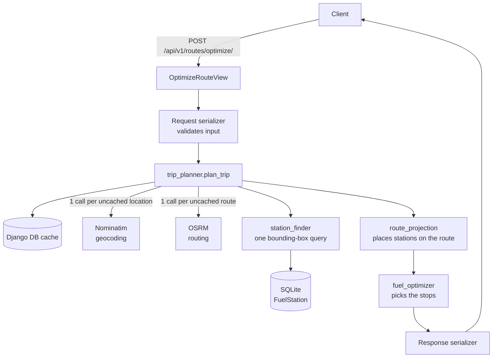

# Fuel Route Optimizer

A Django REST API that plans a driving route between two US locations and works
out the cheapest way to fuel a truck along it.

The vehicle has a **500 mile range** and does **10 miles per gallon**, so it
carries a **50 gallon** tank. Given a start and a finish, the API returns the
route geometry for a map, the distance and duration, and a fuel plan naming
every station where fuel should be bought, the price paid, the gallons taken,
the cost of each stop and the total.

The routing API is called **once per route** and never once per station. All
7,300-odd fuel stations are matched to the route locally.

---

## Contents

- [Architecture](#architecture)
- [Setup](#setup)
- [Environment variables](#environment-variables)
- [Database setup](#database-setup)
- [Importing the fuel dataset](#importing-the-fuel-dataset)
- [Running the server](#running-the-server)
- [API usage](#api-usage)
- [API documentation](#api-documentation)
- [The fuel stop algorithm](#the-fuel-stop-algorithm)
- [Performance](#performance)
- [Testing](#testing)
- [Design decisions and tradeoffs](#design-decisions-and-tradeoffs)
- [Assumptions](#assumptions)
- [Project layout](#project-layout)

---

## Architecture



Four more views, including the request sequence, the fuel policy as a flowchart
and a real plan end to end, are in [docs/architecture.md](docs/architecture.md).

Responsibilities are split so that nothing above the integrations layer knows
which external provider is in use.

| Package | Holds |
| --- | --- |
| `core/` | Geographic maths and the application's error types. No Django, no I/O. |
| `integrations/routing/` | The `RoutingProvider` contract and its OSRM implementation. |
| `integrations/geocoding/` | The `GeocodingProvider` contract and its Nominatim implementation. |
| `fuel/` | The `FuelStation` model, the CSV importer, the city gazetteer and the candidate lookup. |
| `routes/` | The endpoint, the serializers, and the services that plan a trip. |
| `config/` | Settings and URL routing. |

Swapping OSRM for GraphHopper means adding `integrations/routing/graphhopper.py`
and changing one line in `routes/services/providers.py`. Nothing else refers to
OSRM.

---

## Setup

Python 3.12 or newer is required. This was built and tested on Python 3.13 with
Django 6.1.2.

```bash
git clone <repository-url>
cd fuel-route-optimizer

python -m venv .venv
source .venv/bin/activate        # Windows: .venv\Scripts\activate

pip install -r requirements-dev.txt   # or requirements.txt without the test tools
cp .env.example .env
```

### Or with Docker

```bash
docker compose up --build
```

That builds the image, applies migrations, imports the dataset and serves the
API on <http://localhost:8000>. Nothing else is needed.

---

## Environment variables

Every setting has a working development default, so the project runs with an
empty `.env`. `.env.example` documents all of them. The ones worth knowing:

| Variable | Default | Purpose |
| --- | --- | --- |
| `DJANGO_SECRET_KEY` | insecure dev key | **Required** when `DJANGO_DEBUG=false`; startup fails without it. |
| `DJANGO_DEBUG` | `true` | Turn off in production. Also switches on HSTS, secure cookies and SSL redirect. |
| `DJANGO_ALLOWED_HOSTS` | `*` | Comma separated. |
| `VEHICLE_MAX_RANGE_MILES` | `500` | The assignment's figure, configurable so the maths is testable. |
| `VEHICLE_FUEL_ECONOMY_MPG` | `10` | As above. |
| `STATION_CORRIDOR_MILES` | `25` | How far off the route a station may be. See [Design decisions](#design-decisions-and-tradeoffs). |
| `START_FILL_WINDOW_MILES` | `50` | How far ahead to look for the price of the departure tank. |
| `OSRM_BASE_URL` | public demo server | Point at your own OSRM for anything beyond a demo. |
| `NOMINATIM_USER_AGENT` | generic | Nominatim's policy requires a User-Agent identifying your application. |
| `GEOCODE_CACHE_SECONDS` | 30 days | Place names do not move. |
| `ROUTE_CACHE_SECONDS` | 7 days | Road networks change slowly. |

`.env` is gitignored. No secret is committed.

---

## Database setup

```bash
python manage.py migrate
```

That creates the `FuelStation` table with its indexes **and** the cache table.
The cache table is created by a migration on purpose, so there is no second
command to forget and the test database gets it too.

SQLite is the database. See [Design decisions](#design-decisions-and-tradeoffs)
for why.

---

## Importing the fuel dataset

```bash
python manage.py import_fuel_prices data/fuel-prices-for-be-assessment.csv
```

It takes under a second, makes no network calls, and is **idempotent**: the
dataset's own `OPIS Truckstop ID` is the unique key, so running it again updates
prices in place rather than duplicating rows. Output on the supplied file:

```
Rows read:              8151
Stations written:        6452
Skipped (total):        1699
  duplicate OPIS IDs:   879
  outside the USA:      620
  city not in gazetteer:200
  invalid price:        0
  missing fields:       0
  unresolved examples:  Dumont, CO, Saint Johns, FL, Gansevoort, NY, ...
```

Every skipped row is accounted for by a named reason, and a bad row never stops
a good one.

### The dataset has no coordinates

This is the main thing the supplied file forced. Its columns are:

```
OPIS Truckstop ID, Truckstop Name, Address, City, State, Rack ID, Retail Price
```

There is no latitude or longitude, and `Address` is a highway description such
as `"I-44, EXIT 283 & US-69"` rather than a street address. Stations cannot be
matched to a route until they are on the map.

Geocoding 3,813 distinct cities through Nominatim would take over an hour at its
one-request-a-second policy, which is not something a reviewer should have to
run. Instead the repository bundles `data/us_city_coordinates.csv.gz` (605 KiB),
a lookup table of 48,066 US place names built from the **US Census Bureau
Gazetteer** files, which are public domain. Import resolves each city against it
offline.

Place names are matched on a normalised key, because the Census spells things
differently from the fuel feed. Normalisation handles `Saint Louis` against
`St. Louis`, `Nashville-Davidson metropolitan government (balance)` against
`Nashville`, and `Mahwah township` against `Mahwah`. That lifts coverage of the
dataset's US rows from 93.7% to **97.3%**. The remaining 200 rows are
unincorporated communities such as Breezewood, PA, which are in no Census place
file at all; they are reported, not hidden.

To rebuild the gazetteer, including after a new Census release:

```bash
python scripts/build_city_coordinates.py
```

---

## Running the server

```bash
python manage.py runserver
```

The API is then at <http://localhost:8000/api/v1/routes/optimize/>.

---

## API usage

### Request

```http
POST /api/v1/routes/optimize/
Content-Type: application/json
```

```json
{
    "start": "Boston, MA",
    "finish": "New York, NY"
}
```

```bash
curl -X POST http://localhost:8000/api/v1/routes/optimize/ \
  -H 'Content-Type: application/json' \
  -d '{"start": "Boston, MA", "finish": "New York, NY"}'
```

### Response

A real response, with the geometry truncated:

```json
{
  "start": {
    "input": "Boston, MA",
    "resolved_name": "Boston, Suffolk County, Massachusetts, United States",
    "latitude": 42.358834,
    "longitude": -71.05783
  },
  "finish": {
    "input": "New York, NY",
    "resolved_name": "New York, United States",
    "latitude": 40.712728,
    "longitude": -74.006015
  },
  "route": {
    "distance_miles": 214.3,
    "duration_minutes": 282.2,
    "geometry": {
      "type": "LineString",
      "coordinates": [[-71.05783, 42.35883], [-71.08721, 42.34769], "... 32 more"]
    }
  },
  "vehicle": {
    "max_range_miles": 500.0,
    "fuel_economy_mpg": 10.0,
    "tank_capacity_gallons": 50.0
  },
  "fuel_plan": {
    "start_fill": {
      "station": {
        "opis_id": 7344,
        "name": "BEST QUICK STOP",
        "address": "US-1",
        "city": "Peabody",
        "state": "MA",
        "latitude": 42.53431,
        "longitude": -70.96944,
        "route_distance_miles": 0.0,
        "detour_miles": 12.9
      },
      "distance_from_previous_miles": 0.0,
      "gallons": 21.43,
      "price_per_gallon": 3.616,
      "cost": 77.48
    },
    "fuel_stops": [],
    "total_gallons": 21.43,
    "total_cost": 77.48,
    "distance_to_finish_miles": 214.3
  }
}
```

`geometry` is a GeoJSON `LineString` in longitude-then-latitude order, so it can
be handed straight to Leaflet, Mapbox or `folium` without conversion.

### Why the plan has two parts

`start_fill` is the tank bought before setting off. `fuel_stops` lists only the
pull-overs the range forces during the drive, which is why it is empty on the
214 mile route above. Both are priced, and `total_cost` covers the whole trip.

### A longer route

`{"start": "New York, NY", "finish": "Los Angeles, CA"}` returns 2,794 miles and
nine stops:

| Leg | Station | Where | Price | Gallons | Cost |
| ---: | --- | --- | ---: | ---: | ---: |
| start | 7-ELEVEN #40084 | Palisades Park, NJ | $3.099 | 37.62 | $116.59 |
| +376 mi | SHEETZ #639 | Youngstown, OH | $3.059 | 17.22 | $52.66 |
| +172 mi | S&G #88 | Toledo, OH | $3.009 | 42.30 | $127.27 |
| +423 mi | KUM & GO #0267 | Tipton, IA | $2.982 | 36.99 | $110.31 |
| +370 mi | AKAL TRAVEL CENTER | Waco, NE | $2.799 | 50.00 | $139.95 |
| +117 mi | AM ENERGY | Overton, NE | $2.899 | 11.71 | $33.96 |
| +127 mi | FATDOGS OGALLALA | Ogallala, NE | $3.014 | 12.72 | $38.35 |
| +199 mi | CIRCLE K #2709846 | Longmont, CO | $3.057 | 19.94 | $60.96 |
| +341 mi | MAVERIK #693 | Green River, UT | $3.282 | 34.10 | $111.92 |
| +391 mi | Maverik #674 | North Las Vegas, NV | $3.282 | 16.81 | $55.16 |
| +277 mi | *(destination)* | | | **279.40** | **$847.13** |

Note the full 50 gallon tank taken at $2.799 in Nebraska, the cheapest fuel in
range, and the small 11.71 gallon purchase afterwards, just enough to reach the
next cheaper station. No leg exceeds 500 miles, and 279.40 gallons at 10 MPG is
exactly 2,794 miles.

### Errors

Every failure comes back in the same shape, with a stable code. No external
service's error text and no stack trace is ever exposed.

A real one, from `{"start": "Key West, FL", "finish": "Fairbanks, AK"}`:

```json
{
  "error": {
    "code": "NO_FEASIBLE_FUEL_PLAN",
    "message": "No fuel station was found near the start location, so the vehicle cannot be fuelled for departure."
  }
}
```

A route whose stations leave an unbridgeable stretch reports the distance
instead: `"A 612 mile stretch of this route has no reachable fuel station, which
exceeds the vehicle's 500 mile range."`

| Code | Status | When |
| --- | ---: | --- |
| `INVALID_INPUT` | 400 | The body failed validation. Adds a `fields` breakdown. |
| `LOCATION_NOT_FOUND` | 400 | Geocoding found nothing for the text given. |
| `LOCATION_OUTSIDE_USA` | 400 | The location resolved outside the USA. |
| `NO_ROUTE_FOUND` | 422 | No driving route connects the two points. |
| `NO_FEASIBLE_FUEL_PLAN` | 422 | No station near the start, or a gap wider than the range. |
| `ROUTING_SERVICE_UNAVAILABLE` | 503 | OSRM timed out, errored or rate limited. |
| `GEOCODING_SERVICE_UNAVAILABLE` | 503 | Nominatim timed out, errored or rate limited. |

---

## API documentation

With the server running:

- **Swagger UI**: <http://localhost:8000/api/docs/>
- **OpenAPI schema**: <http://localhost:8000/api/schema/>

Generated by drf-spectacular from the serializers, so it cannot drift from the
code. Request and response examples are included.

A Postman collection is committed at
`postman/fuel-route-api.postman_collection.json`. It covers the short route, the
long route, the same start and finish, and the error cases, with assertions on
each (the range limit holds, cost equals gallons times price, gallons match the
distance).

---

## The fuel stop algorithm

### Reducing the problem

Once the route is known, every station becomes a point on a line with two
numbers, a mile position and a price. Geography is finished with before the
optimizer runs.

```
mile 0 ------------------------------------------------- mile 2,794
  |         |              |              |          |
start     $3.06          $3.01          $2.80      $3.28
```

Getting there takes three steps, none of which call an external service.

1. **One bounding-box query.** The route's bounding box, padded by the corridor
   width, is the `WHERE` clause of a single indexed query over `FuelStation`.
2. **Projection onto the route.** Each station is measured against the route
   polyline to get its distance along the route and its distance from it.
   Stations outside the corridor are dropped. This is local geometry, not a
   routing call.
3. **Thinning.** Candidates are reduced to the cheapest station per 5 miles of
   route. At city-centroid accuracy two stations that close are not actually
   distinguishable by position, so keeping the cheaper one throws nothing real
   away, and it bounds the optimizer's input by route length rather than by how
   dense the dataset happens to be. A 2,794 mile route ends up with about 210
   candidates.

Mile positions are rescaled so the polyline's own length matches the distance
OSRM reported. OSRM's figure follows the real road network at full resolution
while the geometry it returns is simplified, so without rescaling the stop
positions would not add up to the total the API reports.

### The policy

At every point where the vehicle holds fuel and has somewhere to be, three rules
are checked in order.

1. **If the destination is within range, buy the fuel to finish and drive
   there.** The vehicle never pulls over once it can reach the end. This is why
   a route under 500 miles returns no stops.
2. **Otherwise a stop is unavoidable, so aim at the cheapest station still in
   range.** Where prices tie, the farthest wins, which means fewer stops.
3. **Buy only enough to reach that station if it is cheaper than here;
   otherwise fill the tank.** Being at the cheapest fuel in the whole reachable
   stretch is the moment to take all 50 gallons. A purchase too small to be
   worth pulling over for is skipped outright whenever the fuel already aboard
   covers the drive to the next station.

Rules 2 and 3 only ever move forward and only ever target a station already
within range, so **the 500 mile limit holds by construction**, not by a check
afterwards.

Before any of this runs, feasibility is settled in one pass: the gaps in the
chain from the start through every candidate to the destination are measured,
and if any exceeds the range the request is rejected with
`NO_FEASIBLE_FUEL_PLAN` naming the distance. That is the exact condition. One
tank covers at most 500 miles, so a wider gap cannot be bridged however the
stations are chosen, and if no gap is wider then every station is reachable from
the one before it. Checking first means the walk can never dead-end halfway.

### Why this policy and not the textbook one

The textbook optimum for the unconstrained gas-station problem is a different
greedy: *buy just enough to reach the next cheaper station*. It was implemented,
run against this one on real routes, and rejected. The measurements:

| Route | Miles | Textbook greedy | This policy |
| --- | ---: | --- | --- |
| New York to Los Angeles | 2,794 | $845.34, 17 stops (5 under 5 gal) | $847.13, 9 stops (0 tiny) |
| Seattle to Miami | 3,302 | $1,025.32, 20 stops (7 under 5 gal) | $1,031.50, 9 stops (0 tiny) |
| Chicago to Houston | 1,087 | $320.45, 5 stops | $322.58, 2 stops |
| Denver to Dallas | 796 | $241.33, 1 stop | **$238.98**, 1 stop |

The textbook greedy buys fuel in dribbles, including a 0.05 gallon stop, which
is not a plan a driver would follow, and the assignment asks explicitly to avoid
stopping unnecessarily. It is also **not actually optimal here**: rule 1 forbids
discretionary stops, which breaks its optimality guarantee, and on Denver to
Dallas it loses by 1%. Costing within about 1% while making half as many stops
is the better trade, and the comparison is in the code as
`classic_greedy_cost` in `routes/tests/test_fuel_optimizer.py`, where every
random instance asserts this policy never beats the unconstrained optimum and
always beats a price-blind baseline.

---

## Performance

### External calls per request

```
1 geocoding call per uncached location   (at most 2)
1 routing call  per uncached route       (at most 1)
0 calls of any kind per fuel station
```

A request where both locations and the route are already cached makes **zero**
external calls. Identical start and finish makes zero as well, because there is
nothing to route.

The test `test_the_number_of_stations_does_not_change_the_number_of_external_calls`
pins this down: a route with 59 stations in the corridor still makes exactly two
geocoding calls and one routing call.

### Measured latency

| Request | Cold | Warm |
| --- | ---: | ---: |
| Denver to Atlanta (1,402 mi) | 1.05 s | 9 ms |
| Seattle to Miami (3,302 mi) | 0.69 s | 24 ms |

Cold time is almost entirely the two external services. Warm, the whole thing is
local, and even the longest route in the contiguous US finishes in tens of
milliseconds.

### Why the local work is fast

Matching 6,452 stations against a route polyline naively is O(stations x
segments). Instead each route segment is filed into the cells of a one-degree
grid that its corridor-padded bounding box covers, and a station is then tested
only against the segments filed in its own cell. This is exact rather than
approximate: if a station lies within the corridor of a segment, that segment's
padded box contains the station, so the segment is filed in the station's cell.

Database work is one indexed bounding-box query returning tuples through
`values_list`, so no model instances are built and there is no N+1. A regression
test asserts the query count stays at one regardless of how many stations match.

### Caching

Django's cache framework with the **database backend**. No Redis, which would be
a service to run for no benefit at this size.

| Cached | Key | Duration |
| --- | --- | --- |
| Geocoding | the location text, lowercased and whitespace-collapsed | 30 days |
| Routing | start and finish rounded to 5 decimals, about one metre | 7 days |

The database backend is deliberate over local memory: it survives restarts and
is shared by every Gunicorn worker, which is what actually protects Nominatim's
one-request-a-second policy. Failures are never cached, so a transient outage
does not persist for a month.

---

## Testing

```bash
pytest
```

226 tests, no network access. Both external providers are replaced at the single
seam `routes/services/providers.py` exposes, so the suite runs offline and the
number of provider calls is observable and asserted.

```bash
pytest --cov=core --cov=fuel --cov=integrations --cov=routes --cov-report=term-missing
```

99% line coverage. What is covered:

- **The endpoint.** Valid short and long routes, every validation failure,
  unknown location, location outside the USA, same start and finish, no feasible
  plan, routing and geocoding outages, method not allowed, the schema and docs
  pages.
- **The optimizer.** The worked example from the brief ($3.00 / $4.00 / $2.80,
  asserting the $4.00 station is skipped), no stop under 500 miles, no spurious
  stop at exactly 500 miles, multi-stop long routes, infeasible routes, and
  40 random instances checking that no leg exceeds the range, that gallons
  always equal distance over MPG, that each cost is gallons times price, and
  that the result sits between a reference optimum and a price-blind baseline.
- **Projection.** Along-route distance, corridor filtering, ordering, rescaling,
  bends, and a long simplified segment whose endpoints are nowhere near the
  station beside its middle.
- **The importer.** Valid rows, every invalid-row reason, duplicate collapsing,
  re-import idempotency, a UTF-8 BOM, missing columns and a missing file.
- **The providers.** Timeouts, connection failures, 429, 4xx and 5xx, unparseable
  bodies, malformed payloads, and OSRM's `NoRoute` code, all mocked.
- **Caching.** Repeat requests, case-insensitive keys, direction sensitivity, and
  that failures are not cached.
- **Logging.** That routing and geocoding requests, optimization failures and the
  import summary are logged, and that a user-supplied location never is.

Linting:

```bash
ruff check .
ruff format --check .
```

---

## Design decisions and tradeoffs

**SQLite, not PostgreSQL.** The dataset is 6,452 rows, candidate lookup is one
indexed bounding-box query, and all geographic maths runs in Python. PostgreSQL
would add a service to run and nothing measurable. PostGIS would add an
extension to install for a `ST_DWithin` that saves no time at this size. Moving
to PostgreSQL later is a `DATABASES` change, because nothing depends on SQLite.

**OSRM, not GraphHopper or OpenRouteService.** It needs no API key, so a
reviewer can clone and run. It returns GeoJSON geometry, distance and duration
in one request. It is self-hostable, so the public demo server is a default and
not a dependency; `OSRM_BASE_URL` points elsewhere. Google Maps is excluded by
the assignment.

**Simplified geometry.** OSRM is asked for `overview=simplified`. The
full-resolution geometry of a transcontinental route runs to tens of thousands
of vertices, which bloats the response and slows projection, while the
simplification error stays far inside a 25 mile corridor.

**A 25 mile corridor.** Wider than it would be with real station coordinates,
and that is the point. Stations sit at their city's centroid, and a city
centroid can be 10 to 20 miles from the interstate exit the truck stop is
actually on. A tight corridor would silently drop valid stations, which is the
worse failure. The cost of 25 miles is that a reported `detour_miles` is a
rough upper bound rather than a real driving detour, so each stop reports its
own figure and a client can filter further.

**Float prices, rounded once.** `retail_price` is stored as a `DecimalField` so
the source values survive exactly, but the optimizer works in floats and money
is rounded to cents once, at the serializer. The source prices are themselves
eight-decimal averages rather than posted prices, so Decimal arithmetic through
the algorithm would be precision theatre at the cost of readability.

**The cache table lives in a migration.** `createcachetable` is easy to forget
and would not run for the test database. Putting it in a migration means
`migrate` leaves the project ready.

**No Celery, Redis or background workers.** A request is one or two HTTP calls
and a few milliseconds of local work. Any of those would be infrastructure to
run for no gain.

---

## Assumptions

Where the assignment left something open, this is what was chosen and why.

| Assumption | Choice |
| --- | --- |
| **Starting fuel** | The tank starts **empty**. Every gallon burned is bought, so `total_gallons` is always exactly the route distance divided by 10. |
| **The departure tank** | A trip starts at a street address, not a truck stop, so the fuel bought before setting off is priced at the cheapest station within 50 route miles of the start and reported separately as `start_fill`. It is not counted as a "stop", which is why a 214 mile route returns `fuel_stops: []` while still costing money. If no station is found in that window the request is rejected rather than guessing a price. |
| **Tank capacity** | 50 gallons, derived as 500 miles divided by 10 MPG rather than configured separately. |
| **Fuel type** | The dataset has one `Retail Price` column with no grade. It is treated as the price of the fuel this vehicle burns, at 10 MPG, so diesel. |
| **Price interpretation** | Dollars per US gallon. Values run $2.69 to $6.40, consistent with that. Prices are a snapshot and are not time-varying. |
| **Corridor width** | 25 miles, straight-line from the route. Justified above. |
| **Projection** | A station's position is the nearest point on the route polyline to it; its along-route distance is the distance to that point, rescaled onto OSRM's reported total. |
| **Candidate thinning** | The cheapest station per 5 miles of route, ties going to the smaller detour. |
| **No station reachable** | `422` with `NO_FEASIBLE_FUEL_PLAN` and a message naming the distance of the offending gap. Never a silently invalid route. |
| **Geocoding** | Nominatim, free text in. The query is deliberately **not** constrained with `countrycodes=us`, because that would quietly snap "Toronto, ON" onto a same-named US place. The location is resolved honestly and rejected on the country that comes back. |
| **Same start and finish** | Answered with a zero-distance route, an empty plan and zero cost, with no routing call. |
| **Range tolerance** | Range comparisons carry half a mile of slack, so a route of almost exactly 500 miles is not told to stop for fuel it does not need. Route geometry is simplified and stations are at city centroids, so mile positions carry real error, not just floating-point error. |
| **Cache duration** | 30 days for geocoding, 7 days for routes. Place names and road networks change on a scale of months. Failures are never cached. |
| **Non-US rows** | The dataset's 620 Canadian rows are rejected at import and counted. |
| **Unplaceable cities** | 200 rows in unincorporated communities cannot be resolved offline. They are reported in the import statistics, not hidden. |

---

## Project layout

```
.
├── config/                      settings, URLs, WSGI/ASGI
├── core/
│   ├── geo.py                   Coordinate, haversine, point-to-segment, bounding boxes
│   └── errors.py                every error a client can see, with its code and status
├── integrations/
│   ├── routing/{base,osrm}.py       RoutingProvider contract and OSRM
│   └── geocoding/{base,nominatim}.py GeocodingProvider contract and Nominatim
├── fuel/
│   ├── models.py                FuelStation and its indexes
│   ├── us_states.py             the USA-only filter
│   ├── management/commands/import_fuel_prices.py
│   └── services/
│       ├── city_coordinates.py  offline city -> coordinate lookup
│       └── station_finder.py    one bounding-box query
├── routes/
│   ├── views.py  serializers.py  urls.py  exception_handler.py
│   ├── migrations/              creates the cache table
│   └── services/
│       ├── trip_planner.py      orchestration and the external-call budget
│       ├── route_projection.py  stations onto the route, via a segment grid
│       ├── fuel_optimizer.py    the policy
│       ├── caching.py           the two cached calls
│       └── providers.py         the single swap seam
├── data/
│   ├── fuel-prices-for-be-assessment.csv
│   └── us_city_coordinates.csv.gz   built by scripts/build_city_coordinates.py
├── scripts/build_city_coordinates.py
├── postman/fuel-route-api.postman_collection.json
├── Dockerfile  docker-compose.yml  docker-entrypoint.sh
└── conftest.py  pyproject.toml  requirements.txt  requirements-dev.txt
```

---

## Attribution

City coordinates are derived from the
[US Census Bureau Gazetteer Files](https://www.census.gov/geographies/reference-files/time-series/geo/gazetteer-files.html),
which are in the public domain. Routing is by [OSRM](https://project-osrm.org/)
and geocoding by [Nominatim](https://nominatim.org/), both over OpenStreetMap
data, © OpenStreetMap contributors, available under the
[ODbL](https://www.openstreetmap.org/copyright).
