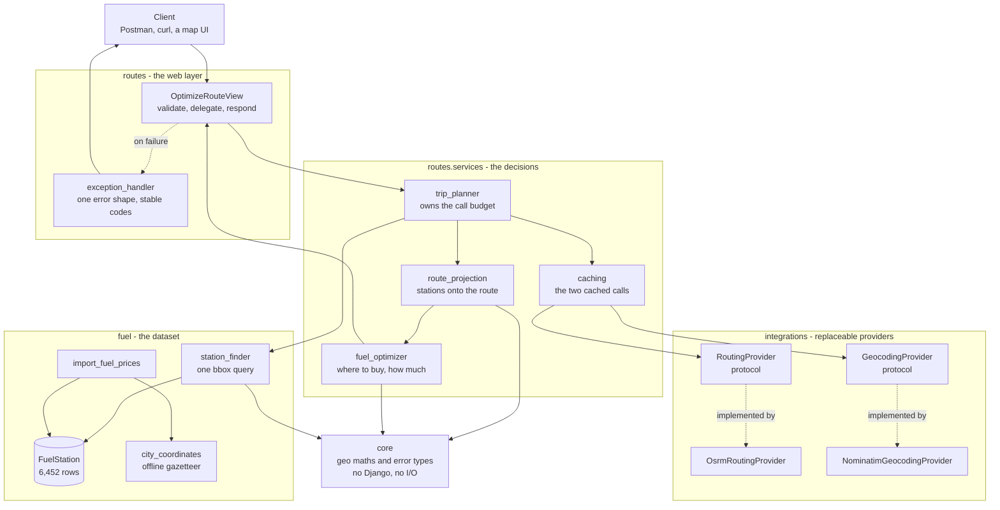
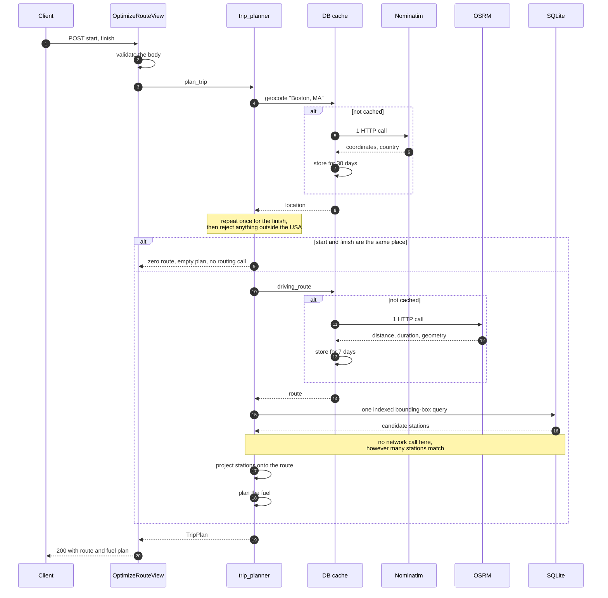
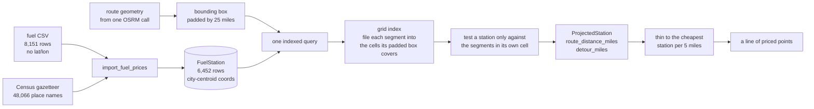
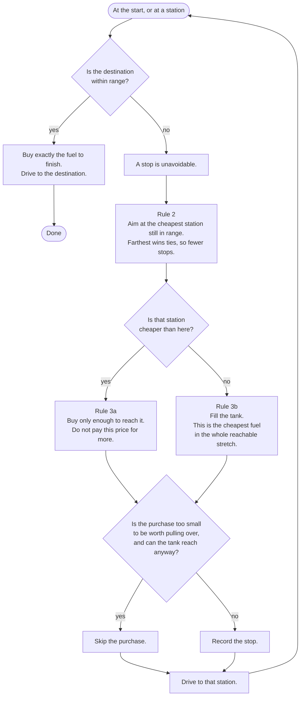
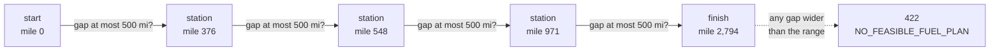

# Architecture diagrams

Five views of the same system, from the outside in. The README explains the
reasoning; this file is the picture.

GitHub renders the Mermaid below directly. The same diagrams are also committed
as PNGs in [`diagrams/`](diagrams/) for viewing offline or dropping into a slide.
To regenerate them after an edit:

```bash
npx -y @mermaid-js/mermaid-cli@11 -i docs/architecture.md -o docs/diagrams/architecture.md
```

---

## 1. Components

What the pieces are and which direction the dependencies point. Nothing above
the integrations layer names OSRM or Nominatim.



---

## 2. What one request costs

The whole external-call budget. Stations never trigger a network call, which is
the constraint the assignment sets.



---

## 3. Getting stations onto the route

The dataset ships no coordinates, so stations have to be placed on the map and
then placed on the route. Both steps are local.



The grid step is what makes this fast. Testing every station against every
segment is tens of millions of comparisons on a transcontinental route. Filing
each segment into the cells its corridor-padded bounding box covers, then
testing a station only against the segments in its own cell, is exact and costs
a fraction of that.

---

## 4. The fuel policy

Three rules, checked in this order. The order is the whole design.



Rules 2 and 3 only ever move forward and only ever target a station already
within range, so the 500 mile limit holds by construction rather than by a check
after the fact.

Feasibility is settled before any of this runs. The gaps in the chain from the
start, through every candidate, to the destination are measured in one pass. A
gap wider than the range cannot be bridged however the stations are chosen, so
the request is rejected with the offending distance instead of the walk
dead-ending halfway.



---

## 5. A real plan

New York to Los Angeles, 2,794 miles. Nine stops, every leg inside 500 miles,
279.40 gallons which is exactly the distance at 10 MPG.

```mermaid
flowchart LR
    S(["START<br/>New York NY<br/>mile 0"])
    A["Youngstown OH<br/>$3.059<br/>17.22 gal"]
    B["Toledo OH<br/>$3.009<br/>42.30 gal"]
    C["Tipton IA<br/>$2.982<br/>36.99 gal"]
    D["Waco NE<br/>$2.799<br/>50.00 gal, full tank"]
    E["Overton NE<br/>$2.899<br/>11.71 gal"]
    F["Ogallala NE<br/>$3.014<br/>12.72 gal"]
    G["Longmont CO<br/>$3.057<br/>19.94 gal"]
    H["Green River UT<br/>$3.282<br/>34.10 gal"]
    I["N Las Vegas NV<br/>$3.282<br/>16.81 gal"]
    Z(["FINISH<br/>Los Angeles CA<br/>mile 2,794"])

    S -->|376 mi| A -->|172 mi| B -->|423 mi| C -->|370 mi| D
    D -->|117 mi| E -->|127 mi| F -->|199 mi| G -->|341 mi| H
    H -->|391 mi| I -->|277 mi| Z

    D:::cheapest
    classDef cheapest fill:#d8f3dc,stroke:#2d6a4f,stroke-width:2px
```



Two things to notice. The full 50 gallon tank taken at $2.799 in Waco, Nebraska,
because nothing cheaper was in range and that was the cheapest fuel for the next
500 miles. And the small 11.71 gallon purchase in Overton immediately after,
which is rule 3a buying just enough to reach cheaper fuel rather than paying the
higher price for a full tank.
